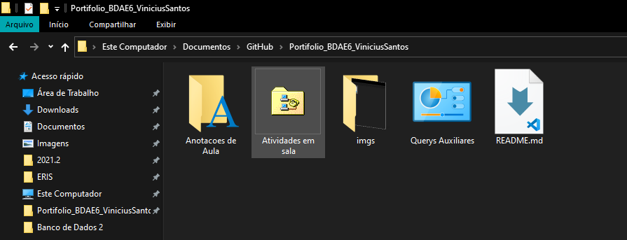

<<<<<<< HEAD
# :bar_chart: BANCO DE DADOS 02 - BDAE6 :minidisc:	

## :mag: Portifolio BDAE6 Vinicius Santos
### Esse Portifolio esta relacionado com a minha materia do IFSP Birigui de Banco de Dados 02 ministrado pela Esp.Helen de Freitas Santos

## :desktop_computer: Portifolio :books:

### Nesse Portifolio separei 3 Pasta ate o momento:

  

### :white_medium_square: Anotações de Aula
  Essa Pasta está dedicada as anotações de aulas disponibilizadas pela professora e com algumas anotações minhas 
  
### :white_medium_square: Atividade em Sala
   Esta Pasta está dedicada as atividades proposta em sala pela professora como: Pesquisas, lições de casa e entre outras atividades pertinente as aulas.
   
### :white_medium_square: Querys Auxiliares
  Esta Pasta esta dedicadas a algumas querys da linguagem SQL que julgo ser interessante e me ajudara em projetos futuros.
  
# :large_orange_diamond: Andamento e Desenvolvimento da Disciplina 

###  MES: AGOSTO

- [:heavy_check_mark:] Aula 01 - 03/08/2021 Obs: 	Apresentação da Disciplina, professora e alunos. Avaliação Diagnóstica
- [:heavy_check_mark:] Aula 02 - 10/08/2021 Obs:  Criação de objetos no banco de dados
- [:heavy_check_mark:] Aula 03 - 17/08/2021 Obs:  Objetos de Banco de Dados: tabelas, indices, constraints e sequences
- [:heavy_check_mark:] Aula 04 - 24/08/2021 Obs:  Índices: por que?
- [:heavy_check_mark:] Aula 05 - 31/08/2021 Obs:  Inserindo os Dados nas Tabelas

###  MES: SETEMBRO

- [:heavy_check_mark:] Aula 06 - 07/09/2021 Obs: Feriado ( Dia da Independencia )
- [:heavy_check_mark:] Aula 07 - 14/09/2021 Obs: Elaboração individual de SQL contendo os conteúdos apresentados
- [:heavy_check_mark:] Aula 08 - 21/09/2021 Obs: IDE para SGBD Oracle, backup, importação de dados
- [] Aula 09 - 28/09/2021 Obs: Cursor, função, procedimento e trigger

=======
# :bar_chart: BANCO DE DADOS 02 - BDAE6 :minidisc:	

## :mag: Portifolio BDAE6 Vinicius Santos
### Esse Portifolio esta relacionado com a minha materia do IFSP Birigui de Banco de Dados 02 ministrado pela Esp.Helen de Freitas Santos

## :desktop_computer: Portifolio :books:

### Nesse Portifolio separei 3 Pasta ate o momento:

### :white_medium_square: Anotações de Aula
  Essa Pasta está dedicada as anotações de aulas disponibilizadas pela professora e com algumas anotações minhas 
  
### :white_medium_square: Atividade em Sala
   Esta Pasta está dedicada as atividades proposta em sala pela professora como: Pesquisas, lições de casa e entre outras atividades pertinente as aulas.
   
### :white_medium_square: Querys Auxiliares
  Esta Pasta esta dedicadas a algumas querys da linguagem SQL que julgo ser interessante e me ajudara em projetos futuros.
  
# :large_orange_diamond: Andamento e Desenvolvimento da Disciplina 

###  MES: AGOSTO

- [:heavy_check_mark:] Aula 01 - 03/08/2021 Obs: 	Apresentação da Disciplina, professora e alunos. Avaliação Diagnóstica
- [:heavy_check_mark:] Aula 02 - 10/08/2021 Obs:  Criação de objetos no banco de dados
- [:heavy_check_mark:] Aula 03 - 17/08/2021 Obs:  Objetos de Banco de Dados: tabelas, indices, constraints e sequences
- [:heavy_check_mark:] Aula 04 - 24/08/2021 Obs:  Índices: por que?
- [:heavy_check_mark:] Aula 05 - 31/08/2021 Obs:  Inserindo os Dados nas Tabelas

###  MES: SETEMBRO

- [:heavy_check_mark:] Aula 06 - 07/09/2021 Obs: Feriado ( Dia da Independencia )
- [:heavy_check_mark:] Aula 07 - 14/09/2021 Obs: Elaboração individual de SQL contendo os conteúdos apresentados
- [:heavy_check_mark:] Aula 08 - 21/09/2021 Obs: IDE para SGBD Oracle, backup, importação de dados
- [:heavy_check_mark:] Aula 09 - 28/09/2021 Obs: Cursor, função, procedimento e trigger

###  MES: OUTUBRO

- [:heavy_check_mark:] Aula 10 - 05/10/2021 Obs: Criação de função, procedimento e trigger
- [:heavy_check_mark:] Aula 11 - 12/10/2021 Obs: Feriado ( Dia das Criancas )
- [:heavy_check_mark:] Aula 12 - 19/10/2021 Obs: Semana Nacional da Ciencia e Tecnologia
- [:heavy_check_mark:] Aula 13 - 26/10/2021 Obs: Importacao de Arquivo Excel

###  MES: NOVEMBRO

- [:heavy_check_mark:] Aula 14 - 02/11/2021 Obs: Feriado ( Finados )
- [] Aula 15 - 09/11/2021 Obs: View, Privilégio (Grant)
- [] Aula 16 - 16/11/2021 Obs: View, Privilégio (grant), Instalação do SGBD
- [] Aula 17 - 23/11/2021 Obs: Elaboração Individual de um Projeto de Banco de Dados
- [] Aula 18 - 30/11/2021 Obs: Elaboração Individual de um Projeto de Banco de Dados

###  MES: DEZEMBRO

- [] Aula 19 - 07/12/2021 Obs: Seminário: Apresentação dos projetos de banco de dados
- [] Aula 20 - 14/12/2021 Obs: Seminário: Apresentação dos projetos de banco de dados

